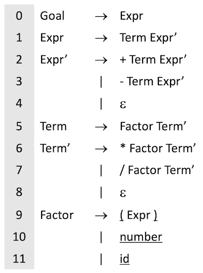

# Recursive Descent Parsers and Tree Building

In this homework assignment, you will:

1. Complete a partial implementation of the Expression grammar from the lecture (see below)
1. Write a tree-walker that can evaluate a numerical expression

## Expression grammar



## Recursive descent parsers

Section 3.3.2 of _"Engineering a Compiler"_ talks about _recusive descent parsers_, named such because they start at the top of the grammar and work down to the terminals. We'll be hand-coding an LL parser for the expression grammar talked about in class.

It turns out recursive descent parsers have a very predictable code structure; in fact, the ANTLR parser generator emits _code_, not tables, so you can more easily debug it.

In general, a recursive descent parser has one method per non-terminal. So in the case of our grammar, you will have 6 methods handling the parsing: Goal, Expr, ExprPrime, Term, TermPrime, and Factor. If there are multiple terms to a production (eg. `Expr -> Term ExprPrime`), then you'll simply call each of those methods. If there are alternatives in a non-termal, you'll have `if` statements to determine with path you should take.

Here's a minimal example based on the provided code:

```csharp
private void ExprPrime()
{
    var t = TokenStream.GetToken();

    if (t.TokenType == AddOperator)
    {
        Match(AddOperator);
        Term();
        ExprPrime();
    }
    else if (t.TokenType == SubOperator)
    {
        Match(SubOperator);
        Term();
        ExprPrime();
    }
}
```

This code implements productions 2, 3, and 4 (the last by implication) from the grammar. As you can see, the parser has a very natural recursive aspect to it, especially down in `Factor` which will make a call all the way up to `Expr`!

Now, if we want to do anything useful with our grammer--such as building a _parse tree_ (discussed in the next section)--we'll need to return something from each method. In our case, we're going to return a `TokenTreeNode`, which is a simple class that turns `Token`s into a tree data structure. See the provided code examples for how that works.

## Tree walkers

As we'll discover next week, many modern parser generators produce [Parse Trees](https://en.wikipedia.org/wiki/Parse_tree) when processing your input source file. These parse trees are the first step in making your compiler understand what the input _means_, not just what it says.

The method by which you interact with the parse tree is a _tree walker_, which is a program/class that [traverses the tree](https://en.wikipedia.org/wiki/Tree_traversal). You already know these techniques from Data Structures and Algorithms; they're no different here.

One interesting thing about many compiler tree walkers is that they don't do stuff on every node: they only do things on _certain_ nodes. We'll use this technique a lot in part 2 of the homework.

## Homework part 1 - finish the parser

Find the `TODO` items and implement the missing code.

-   [ ] Finish the scanner code in [src/Scanners/Scanner.cs](src/Scanners/Scanner.cs) to populate the list of tokens.
-   [ ] Finish the parser code in [src/Parsers/RecDescentParser.cs](src/Parsers/RecDescentParser.cs) by finishing the implementation of the various grammar rules.

## Homework part 2 - finish the tree evaluator

Once the [scanner tests](tests/BasicScannerTests.cs) and [parser tests](tests/BasicParserTests.cs) are passing, you can now work on the [evaluator tree walker](src/Tree/TreeEvaluator.cs).

Note that when you run the evaluator tree walker, you pass in a `Dictionary<string,int>` of variables and their values. This allows you to evaluate expressions like `3 + x`.

-   [ ] Implement `EvaluateImpl()` in [src/Tree/TreeEvaluator.cs](src/Tree/TreeEvaluator.cs).
-   [ ] Verify all the tests pass in [tests/EvaluationTests.cs](tests/EvaluationTests.cs).
